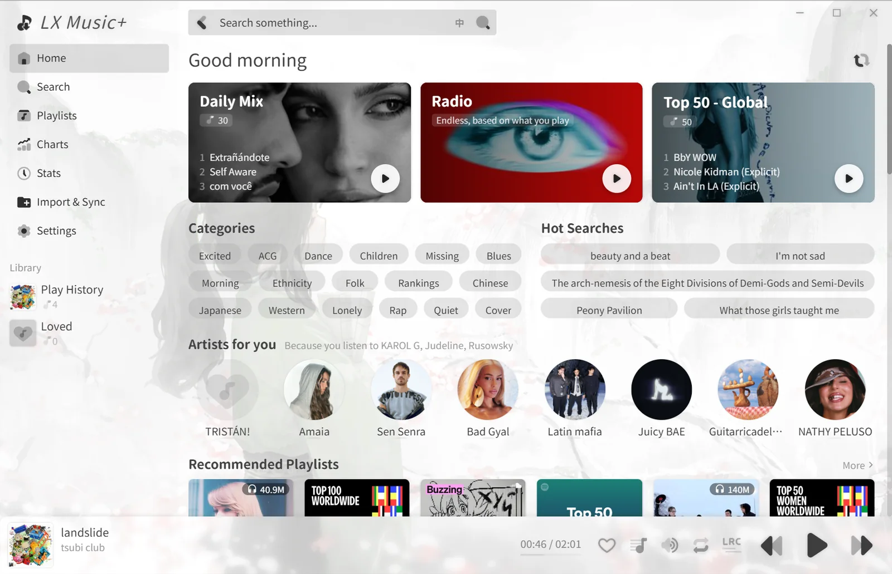
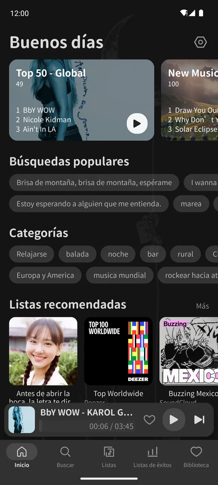
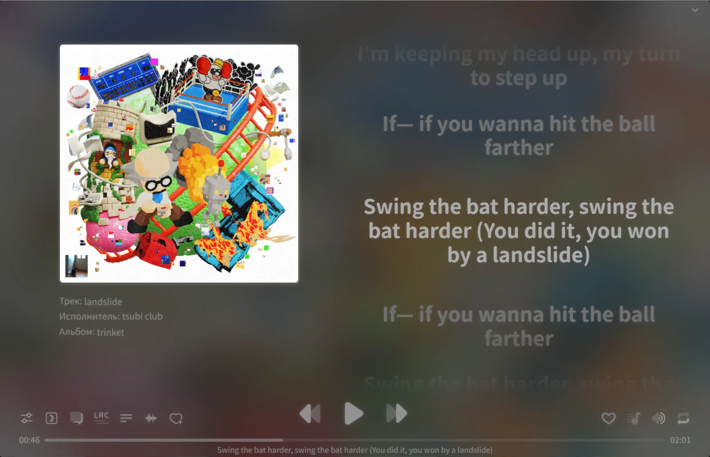
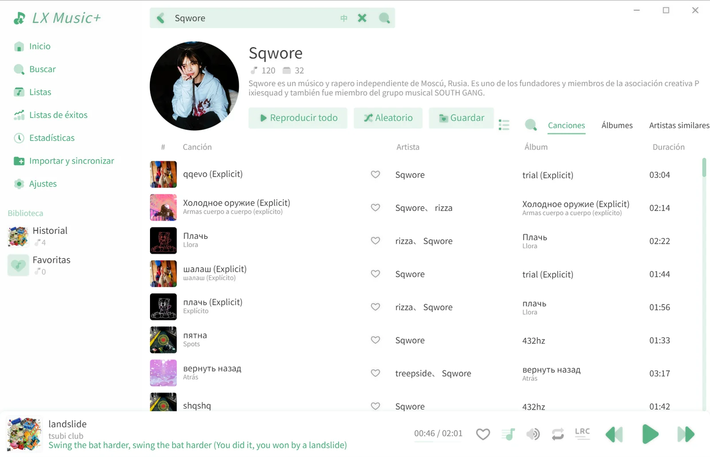
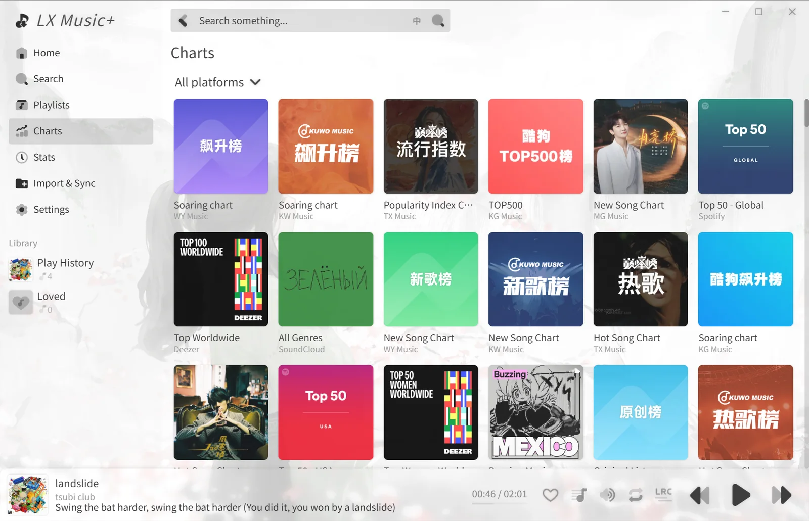
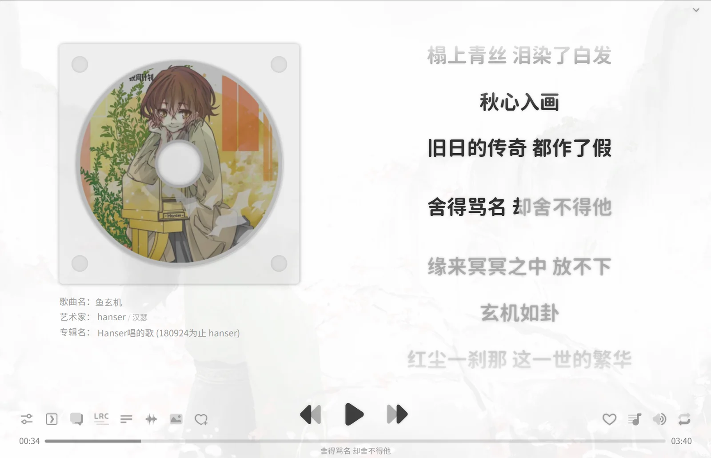
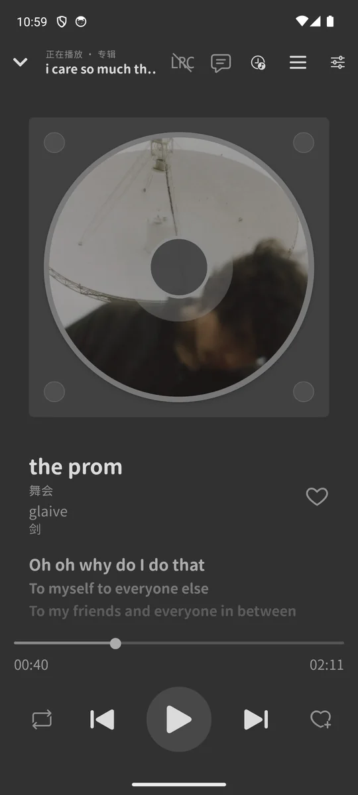
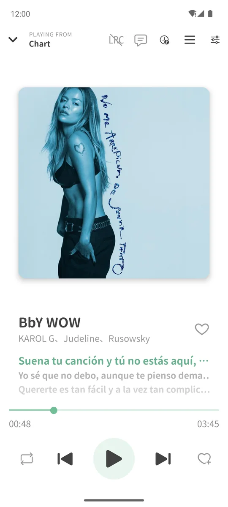
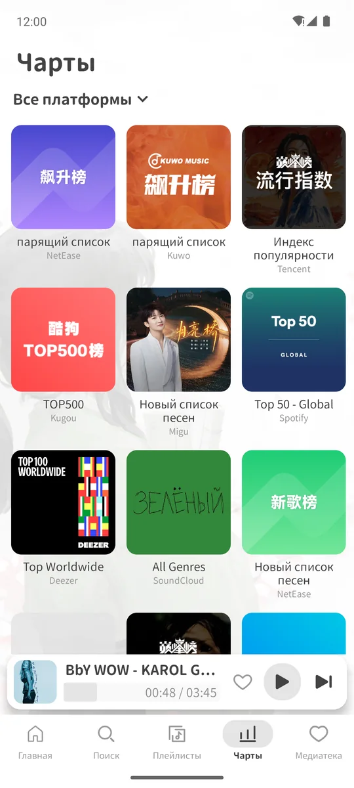

<div align="center">

# LX Music+

An unofficial fork of [LX Music](https://github.com/lyswhut/lx-music-desktop) (洛雪音乐助手) for **Windows, Linux and
Android**: a new interface, more data sources and 13 languages.

[](https://github.com/dlvkz/lx-music-plus/releases/latest)
[](https://github.com/dlvkz/lx-music-plus/releases)

[](#license)

&nbsp;


</div>

> LX Music+ is **not** made or supported by the LX Music team. Please report its problems
> [here](https://github.com/dlvkz/lx-music-plus/issues), not to LX Music.

## Download

Get the latest version from [**Releases**](https://github.com/dlvkz/lx-music-plus/releases/latest). Each release has
both apps.

| Platform | File | Notes |
| --- | --- | --- |
| **Windows** | `lx-music-plus-v…-x64-Setup.exe` | Not code signed: Windows SmartScreen may warn the first time you open it |
| **Linux**, any distribution | `.AppImage` (x64, arm64) | No install: make it executable, then run it. It updates itself. Ubuntu 22.04 and later need FUSE 2 (`sudo apt install libfuse2`, or `libfuse2t64` on 24.04) |
| **Debian, Ubuntu, Mint, Pop!_OS** | `.deb` (amd64, arm64) | `sudo apt install ./lx-music-plus_…_amd64.deb` |
| **Fedora, openSUSE, RHEL** | `.rpm` (x86_64, aarch64) | `sudo dnf install ./lx-music-plus-….rpm` |
| **Arch, Manjaro, EndeavourOS** | `.pacman` (x64, arm64) | `sudo pacman -U lx-music-plus-….pacman` |
| **Android** | `arm64-v8a` APK for most phones, `universal` if unsure | |

## Getting started

LX Music+ doesn't include any audio source. Add sources from a link, a file or the built-in addon store in **Settings&nbsp;→&nbsp;Sources**.

## Features

<table>
  <tr>
    <td width="50%"></td>
    <td width="50%"></td>
  </tr>
  <tr>
    <td>The player with synced lyrics <sub>(Black theme, Русский)</sub></td>
    <td>Artist pages, with names and bios translated live <sub>(Green theme, Español)</sub></td>
  </tr>
  <tr>
    <td></td>
    <td></td>
  </tr>
  <tr>
    <td>Charts of every platform in one place <sub>(China Ink theme, English)</sub></td>
    <td>The CD cover, the default of the player <sub>(China Ink theme, 简体中文)</sub></td>
  </tr>
</table>

- **Home** with charts, playlists, albums and artists from many platforms, a Daily Mix and an endless Radio
- **More sources**, with combined search, artist and album pages
- **Sources** as installable addons, with a built-in addon store and one-click **Install all**
- **Charts** from many platforms, mixed together
- **Import** your library from other music apps or CSV files
- **Sync**: pair your phone with your computer on the same Wi-Fi in a few taps
- **Last.fm** recommendations, similar artists and scrobbling
- **Listening stats**, a play queue that shows what is playing from, and resume after restart
- **Themes**, light and dark, with backgrounds. By default the app follows the light / dark mode of the system: China Ink
  in light mode, Black in dark mode
- Desktop: a resizable window that scales the interface to its size

### On Android

<p align="center">
  &nbsp;&nbsp;
  &nbsp;&nbsp;
  <br>
  <sub>The player with the CD cover and its dynamic background <sub>(Black theme, 简体中文)</sub>, with the square cover
  <sub>(Green theme, English)</sub>, and the charts <sub>(China Ink theme, Русский)</sub></sub>
</p>

## Languages

English, 简体中文, 繁體中文, 日本語, 한국어, Español, Português (Brasil), Русский, Tiếng Việt, Deutsch, Français, Italiano,
Polski. The app starts in the language of the system and asks on first launch. Song and artist names written in another
script are translated live into your language.

## Build from source

```bash
# desktop
cd desktop
npm install
npm run pack          # Windows x64 installer (desktop/build/)
npm run pack:linux    # on Linux: AppImage, deb, rpm and pacman for x64 and arm64 (needs rpm and bsdtar)

# Android
cd mobile
npm install
cd android && ./gradlew assembleRelease
```

The desktop and the Android app share their version: a release always has both, so the update check of each app finds
it (`desktop/publish/version.json`, `mobile/publish/version.json`).

## Disclaimer

LX Music+ does not host, store or distribute any music. It shows public data from music platforms and plays audio
from the sources the user adds or enables. The project is not responsible for the legality or correctness of that
data. Do not use it where it is against the law, and please support the artists and the official platforms.

LX Music+ is free and non-commercial: no ads, no paid features, no donations.

The terms of use of LX Music still apply to LX Music+, see [项目协议 (terms of use)](desktop/README-LX-Music.md#项目协议)
in the original README.

## Credits

- [LX Music](https://github.com/lyswhut/lx-music-desktop) ([mobile](https://github.com/lyswhut/lx-music-mobile)) by
  lyswhut and its contributors: LX Music+ is built on it
- [Any Listen](https://github.com/any-listen/any-listen) by lyswhut: the interface of the desktop app
- [Nuclear](https://github.com/nukeop/nuclear): ideas for the sources, the radio, the stats and Last.fm
- [yt-dlp](https://github.com/yt-dlp/yt-dlp), [Last.fm](https://www.last.fm/api) (data powered by Last.fm)
- Fonts: [Resource Han Rounded](https://github.com/CyanoHao/Resource-Han-Rounded), [Inter](https://github.com/rsms/inter), SIL Open Font License 1.1

## License

Each app keeps the license of the code it is built on, see [LICENSE](LICENSE):

- **desktop**: its interface includes code ported from [Any Listen](https://github.com/any-listen/any-listen), so it is
  licensed under the same terms, the **GNU Affero General Public License v3.0 with additional terms that prohibit
  commercial use**, see [desktop/LICENSE](desktop/LICENSE). The code of LX Music it is based on is also available
  under the Apache License 2.0, see [desktop/LICENSE-LX-Music](desktop/LICENSE-LX-Music).
- **mobile**: the [Apache License 2.0](mobile/LICENSE), like LX Music mobile.
